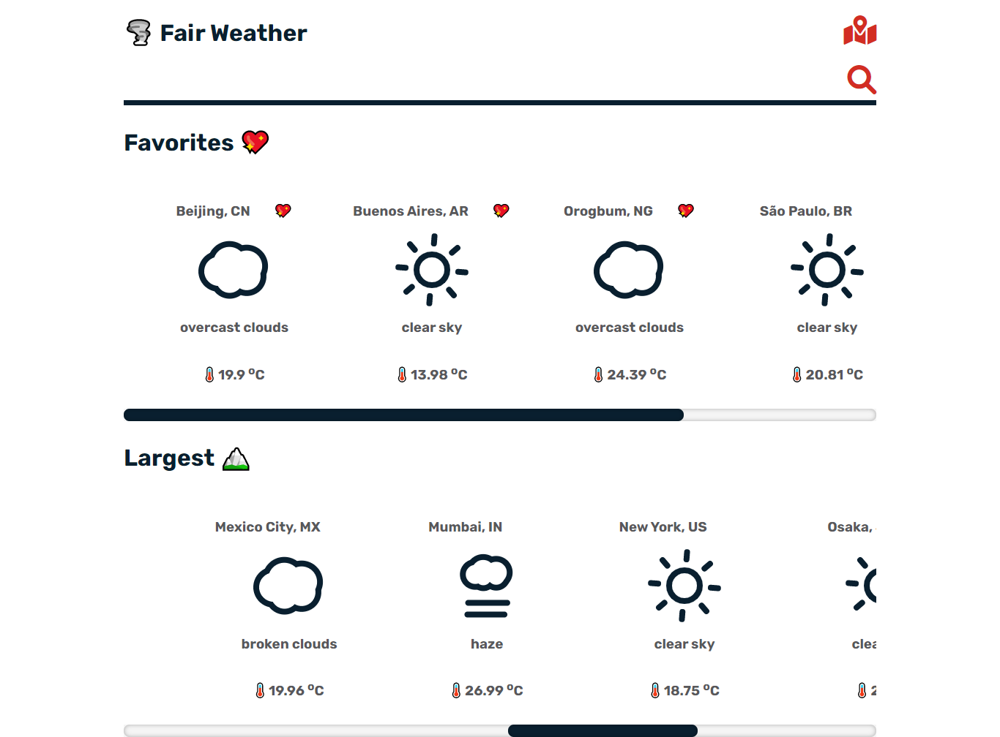
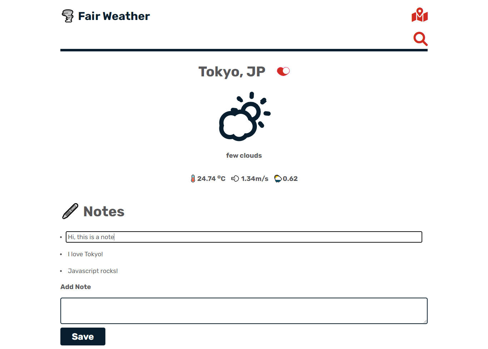

## Fair Weather App

**API** [Open Weather Map](https://openweathermap.org/)

**Live App** [https://fair-weather-krk8m35mo-atlasmoth.vercel.app/](https://fair-weather-krk8m35mo-atlasmoth.vercel.app/)

## Features

- Find weather in your city with openweathermap geocoding.
- Search weather in any city.
- Save favorite cities to localstorage.
- Find weather in the world's most populated cities.
- Create, edit and delete notes scoped to the context of each city.
- Testing with React testing library.
- Persist favorites and largest cities to local storage and refresh cache upon app reload.
- Largest cities are loaded from dummy data at first but are subsequently refreshed with live data and persisted to localStorage.
- geoencoding with openweathermap API

NB => My API subscription is rate limited.

